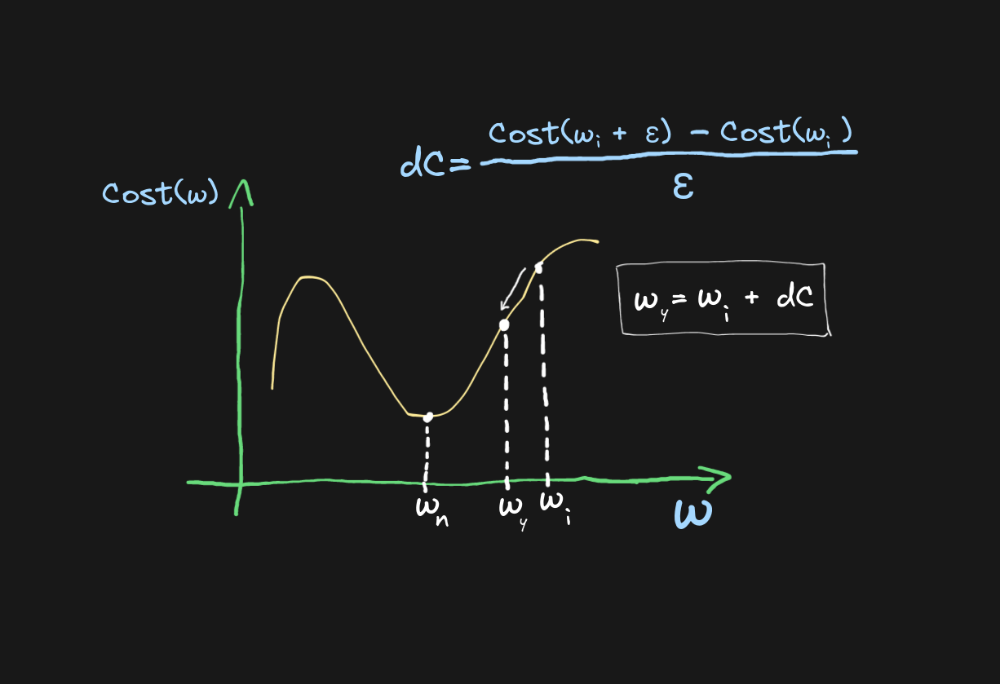

# Session 4

```
"The Most Important Machine Learning Alghoritem"
```
---

* As of right now I have been using the `finite difference` method to optimize the `cost function` of the neural network
    * This approach could be regarded as a `stupid hack` because it tries to simulate `gradient descent` but at the same time it is very slow
    * On the other hand, I think that using the `finite difference` method is a great introduction to understading how `gradient descent` works without having to talk about a more complex approach using `backpropagation`

### Remembering The Finite Difference Method 
* Let's talk about the `cost function` which is a messure of how good or how bad your model performs
    * **Higher** `cost` → **worse the performance**
    * **Lower**  `cost` → **better the performance**
* Let's think of our `cost function` as a *mathematical function*
    * Now our function can be represented as a graph ~ it can be *plotted*
    * Let's describe the `cost` as points on the function curve and have the ideal `cost` be the `minimum` of our function
* We can then try to drive the `cost` towards the `minimum` of the function by computing approximated derivatives which tell us the direction the function is growing and tweaking the neural network parameters which results in our function *slowly* falling towards 0 
* Let's call this approximated derivative `dC` the `velocity` where the function wants to grow
    $$ dC = \frac{cost(\omega_i + \varepsilon) - cost(\omega_i)}{\varepsilon}$$
    * $\omega_i$ represents the i-th set of possible values for our parameters 
    * $\varepsilon$ represents the chosen value by which we tweak the $\omega_i$ parameters



---

### The Core Problem With Approximating The Direction Of Movement
* As we disscussed before we are optimizing the `cost` by tweaking parameters of our model with an arbitrary value $\varepsilon$ which is usally a small value since larger values tend to drive the learning process out of control
* Because we determine the value of $\varepsilon$ manually we tend to pick the value that drives us to the `minimum` as fast as possible
* **The problem**: We pick a value that at some point in the learning process starts to jump around the `minimum` and meks it impossible for the `cost function` to improve
    * Note: The closer we are to the `minimum` the higher is the **sensitivity** of the tweaking parameter 
* The `cost function` is usually *more sensitive* to some parameters than other parameters, but using $\varepsilon$ *assumes equal sensitivity* to all parameters which is the leading cause for for this method not being optimal and being inaccurate 

* *All this approximation has been a very limiting factor in our learning!*    

---

## Gradient Descent ~ The Better Way

* Slowly transitioning to using only LaTeX:
[Gradient Descent](./grad.pdf)

### introduction With One Variable
* We calculated the actual correct derivative for our `cost function` with one parameter represented in the document as $C'$

### The Advantage
* The core idea remains the same:
    * *Optimize the cost function by looking at the growth of the function and moving the opposite direction towards the `minimum`*

* **The major difference**:
    * Before we have chosen an arbitrary value $\varepsilon$ by which we modified the `cost function` and we encountered issues when dealing with *sensitivity* of the parameters of our model

* Faster on the computation level
    * Using `finite difference` method on the level of computation is slower because you have to compute the cost twice
        * First you compute the *original cost* then you modify the neural network and you compute the *new cost* which you subtract from the original cost to find the differance 
    * On the other hand using `gradient descent` you compute the cost **only once**
        * You compute the derivative of the cost function

* **The Advantage**: Faster and more accurate perforamce

### What Is A Gradient?
* **Gradient** is in essence a **derivative** for a **multivariable function**

* In contrast to returning a single number it produces a *vector* which shows the growth of a function 
* Since our model can have many parameters the *gradient* is going to be a *vector* with as many values as there are paramenter in the model
    * In other words ***Gradient is a vector of derivatives for each input parameter***
* As before you substract the calculated gradient from your model
    * Substract the vector of derivatives from the vector of parameters

